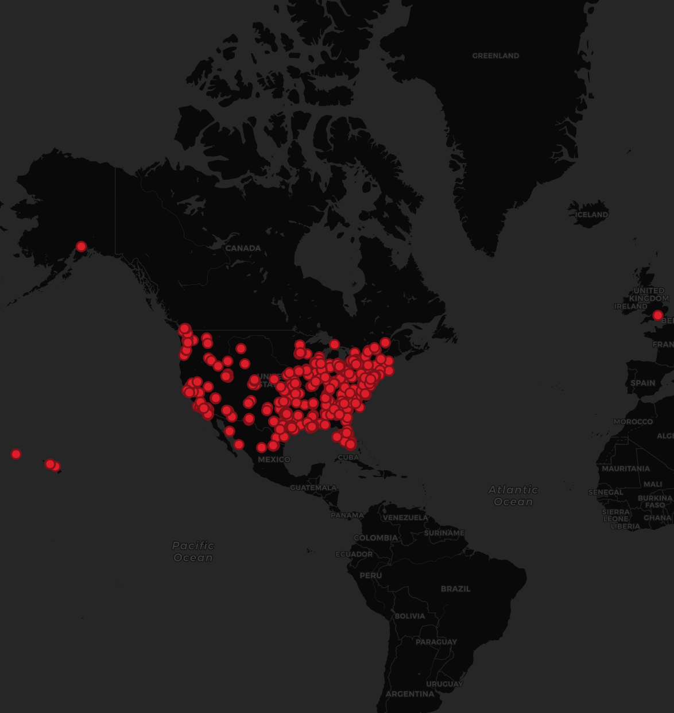

# Geo-tagged-Tweets

## Analysis
The image above is a map of geo-tagged twitter data that was harvested using an API-based Crawler. A python based library, tweepy, was used to filter tweets through the keyword 'blm', which provides data that gives you insight into the public perception of the black lives matter movement. Almost all of the tweets were made in the United States, with an exception of 4 tweets that were sent from the United Kingdom and the Hawaiian Islands. A majority of the tweets were also made in the NE and SE part of the country. This could be due to the time of day among a number of factors, as well as the social and political climates in the Eastern part of the country which likley differ greatly from the Western part of the country at the moment. 
